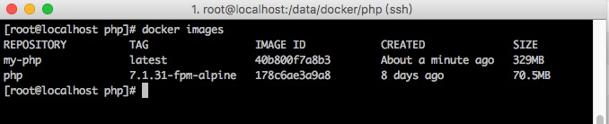

## 创建 PHP 镜像

1. 创建目录& Dockerfile

> mkdir php
>
> cd php
>
> touch Dockerfile


2. 编写 Dockerfile

```shell
# 基础镜像
FROM php:7.3-fpm-alpine

# 设置依赖包仓库地址为 dl-cdn.alpinelinux.org/mirrors.aliyun.com
RUN sed -i "s/dl-cdn.alpinelinux.org/mirrors.aliyun.com/g" /etc/apk/repositories
 
# 下载安装 PHP 扩展需要的依赖
RUN apk add --no-cache autoconf g++ libtool make curl-dev libxml2-dev linux-headers libmemcached-dev zlib-dev libzip-dev freetype-dev libjpeg-turbo-dev libpng-dev imap-dev rabbitmq-c-dev

# 安装 PHP 核心扩展。请记住，您必须手动为扩展安装依赖项。如果扩展需要自定义 configure 参数，则可以使用 docker-php-ext-configure。
RUN docker-php-ext-install -j$(nproc) pdo_mysql zip bcmath \
    && docker-php-ext-configure gd --with-freetype-dir=/usr/include/ --with-jpeg-dir=/usr/include/ \
    && docker-php-ext-install -j$(nproc) gd \
    && docker-php-ext-configure imap --with-imap --with-imap-ssl \
	&& docker-php-ext-install -j$(nproc) imap

# PHP 源代码不提供某些扩展，但可以通过 PECL 获得。要安装 PECL 扩展，请使用 pecl install 下载和编译它，然后使用 docker-php-ext-enable 来启用它。与PHP核心扩展不同，PECL扩展应该串联安装，否则PECL会跳过错误。例如，pecl install memcached-2.2.0 && pecl install redis-2.2.8 而不是 pecl install memcached-2.2.0 redis-2.2.8。但是，docker-php-ext-enable memcached redis 可以在一个命令中。
RUN pecl install redis-4.0.2 \
    && pecl install mongodb-1.5.3 \
    && pecl install memcached-3.1.3 \
    && pecl install amqp-1.9.4 \
    && docker-php-ext-enable redis mongodb memcached amqp

# 安装 tideways 扩展
RUN curl -L -o /tmp/tideways.tar.gz "https://github.com/tideways/php-xhprof-extension/archive/v4.1.6.tar.gz" \
    && mkdir tideways \
    && tar -xf /tmp/tideways.tar.gz -C tideways --strip-components=1 \
    && rm /tmp/tideways.tar.gz \
    && ( cd tideways && phpize && ./configure && make -j$(nproc) && make install ) \
    && docker-php-ext-enable tideways \
    && rm -r tideways

# 安装 composer
RUN curl -sS https://getcomposer.org/installer | \
    php -- --install-dir=/usr/bin/ --filename=composer \
    && composer config -g repo.packagist composer https://mirrors.aliyun.com/composer/
```


3. 创建镜像

> docker build -t my-php .


4. 查看镜像，发现 my-php 已经创建成功




5. 上传镜像到阿里云镜像仓库

```shell
# 登录
docker login --username=18852951201@163.com registry.cn-shanghai.aliyuncs.com
# 修改镜像的标签和仓库地址
docker tag [IMAGE ID] registry.cn-shanghai.aliyuncs.com/bmtrip/php
# 推送到镜像仓库
docker push registry.cn-shanghai.aliyuncs.com/bmtrip/php
```

#### 备注

- 需要使用该镜像时，执行 `docker pull registry.cn-shanghai.aliyuncs.com/bmtrip/php` 即可