### PHP 性能分析工具（tideways + xhgui+ nginx + php）

#### 介绍

本文讲述了搭建一个 PHP 性能分析平台，不用改动程序的代码，通过 nginx 在程序上方加一层监控层（产出固定日志），分析日志信息，进行性能分析优化

- [PHP xhprof 扩展](https://github.com/phacility/xhprof) - Facebook 开发的 PHP 性能追踪及分析工具（长期未更新）
- [PHP tideways 扩展](https://github.com/tideways/php-xhprof-extension) - xhprof 的分支，支持 PHP7（持续维护）
- [xhgui](https://github.com/luo-ding/xhgui-branch) - xhprof 分析数据的 GUI 系统，xhprof 生成的日志和 tideways 生成的日志格式通用


#### 环境准备

安装之前确保已经正确安装了以下软件

- PHP
- Nginx
- Mongodb


#### 安装 PHP mongodb 扩展

- 在 [用Docker创建一个PHP镜像](../快速构建服务环境/用Docker创建一个PHP镜像.md) 中已经演示了如何添加 mongodb 扩展

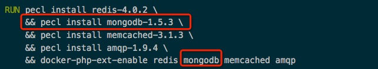


#### 安装 PHP tideways 扩展

- 在 [用Docker创建一个PHP镜像](../快速构建服务环境/用Docker创建一个PHP镜像.md) 中已经演示了如何添加 tideways 扩展

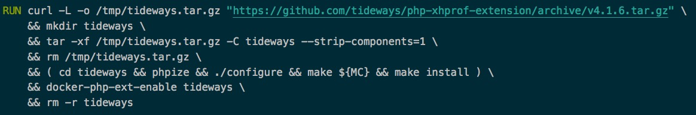


#### 安装 xhgui-branch（xhgui 的汉化版）

```shell
$ git clone https://github.com/laynefyc/xhgui-branch.git
$ cd xhgui-branch
$ php install.php
```

修改 xhgui-branch 配置文件 （config/config.default.php）

```php
<?php
    return array(
    	...
    	'extension' => 'tideways',
    	...
        'save.handler' => 'mongodb',
        'db.host' => 'mongodb://127.0.0.1:27017',
        'db.db' => 'xhprof',
        ...
        #xhgui 默认是采集1% ,如果是排查问题时还是希望能够100%采集会比较方便。进入xhgui源码目录，修改config/config.default.php文件，
        #平时仍然按1%的采样率采样，防止数据增长过快，当想调试时，就在URL中添加debug=1的参数即可。
        #在xhgui/config/config.default.php中，找到profiler.enable这里，按如下修改：
        //采样率
        'profiler.enable' => function() {
            // url 中包含debug=1则百分百捕获
            if(!empty($_GET['debug'])){
                return true;
            } else {
                // 1%采样
                return rand(1, 100) === 42;
            }
        },
    	...
	);
```


#### 启动 mongodb 并设置 xhgui 索引，命令如下：

```shell
$ mongo

> use xhprof
> db.results.ensureIndex( { 'meta.SERVER.REQUEST_TIME' : -1 } )
> db.results.ensureIndex( { 'profile.main().wt' : -1 } )
> db.results.ensureIndex( { 'profile.main().mu' : -1 } )
> db.results.ensureIndex( { 'profile.main().cpu' : -1 } )
> db.results.ensureIndex( { 'meta.url' : 1 } )
```


#### xhgui 本地虚拟主机配置参考

```shell
server {
    listen       80;
    server_name  local.xhgui.com;
    root  /var/www/html/xhgui/webroot;

    location / {
        index  index.php;
        if (!-e $request_filename) {
            rewrite . /index.php last;
        }
    }

    location ~ \.php$ {
        fastcgi_pass   php73:9000;
        fastcgi_index  index.php;
        fastcgi_param SCRIPT_FILENAME $document_root$fastcgi_script_name;
        include        fastcgi_params;
    }
}
```

重启 nginx 后，浏览器访问 local.xhgui.com 就可以查看效果了

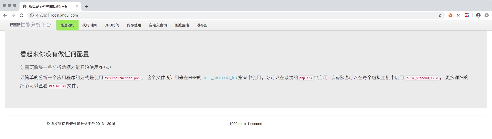


#### 站点设置

针对要分析的站点进行设置，直接在要分析站点的 nginx 配置中增加以下项，然后使配置生效就可以了。

```shell
$ fastcgi_param PHP_VALUE "auto_prepend_file=/path/xhgui-branch/external/header.php";
```

参考配置

```shell
server
{
    listen       80;
    server_name  local.order.com;
    root   /var/www/html/Order/public;
    location / {
            index  index.php;
    }
    if (!-e $request_filename) {
            rewrite ^/(.*)  /index.php?$1 last;
    }
    location ~ \.php {
            fastcgi_pass   php71:9000;
            fastcgi_index  index.php;
            fastcgi_param  SCRIPT_FILENAME  $document_root$fastcgi_script_name;
            # 添加 PHP_VALUE，告诉 PHP 程序在执行前要调用的服务
	        fastcgi_param  PHP_VALUE "auto_prepend_file=/var/www/html/xhgui/external/header.php";
            include        fastcgi_params;
            fastcgi_read_timeout 9999;
    }
    access_log      /var/log/nginx/order_access.log;
    error_log       /var/log/nginx/order_error.log;
}
```

或者也可以在修改 PHP 配置文件（php.ini），告诉 PHP 程序在执行前要调用的服务

```shell
; Automatically add files before PHP document.
; http://php.net/auto-prepend-file
auto_prepend_file = "/var/www/html/xhgui/external/header.php"
```

当该站点收到请求后，再次访问 local.xhgui.com，就可以看到如下效果

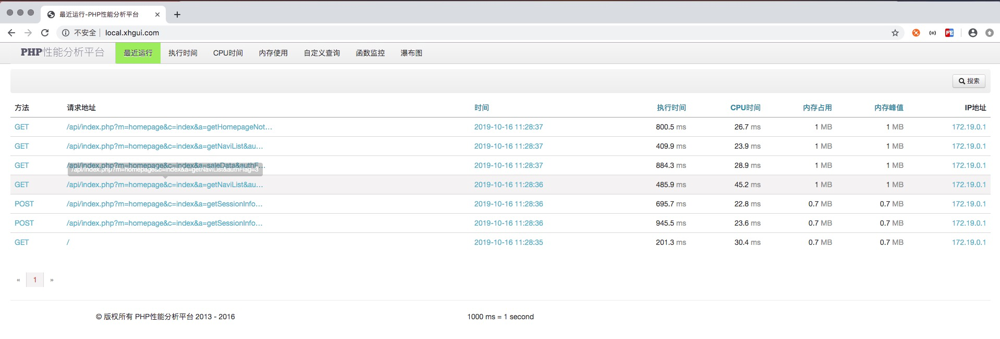


#### xhgui 的具体使用

- 最近运行


- 按照时间范围和请求地址搜索

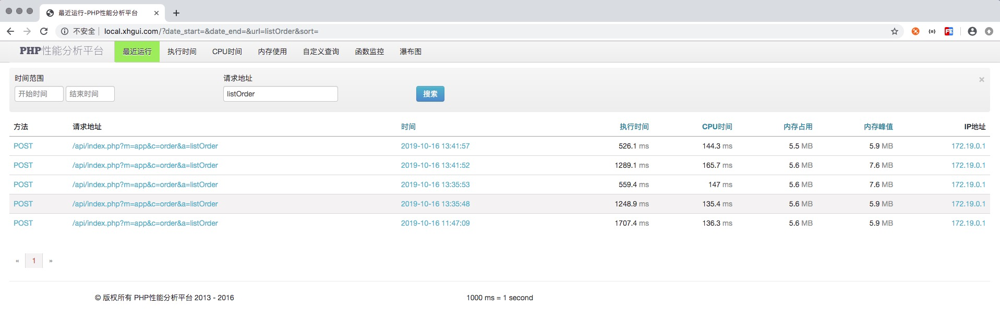

- 按照执行时间、CPU时间、内存占用排序

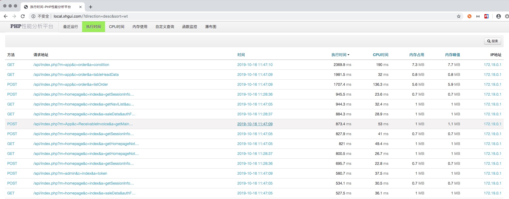

- 点击某个请求，查看这个请求最近的趋势

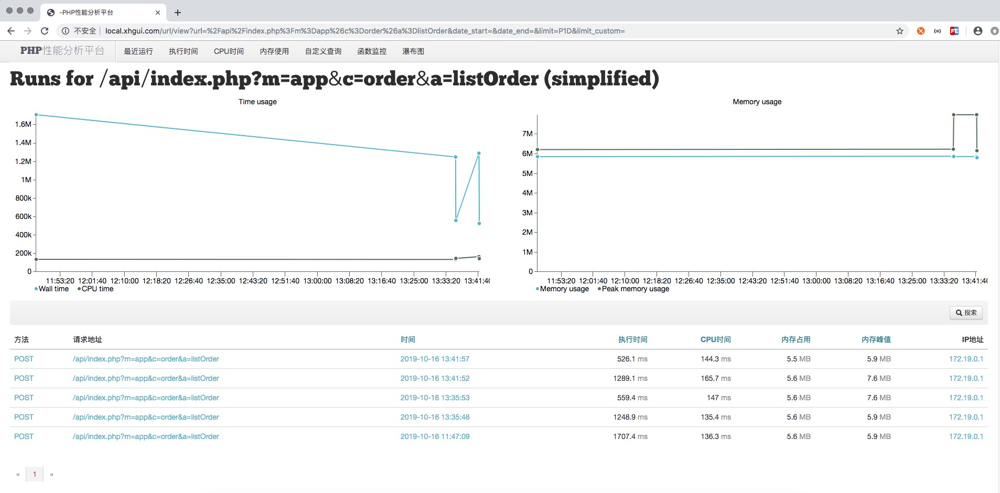

- 查看一次请求的详细情况（包含SQL执行详情，各函数调用情况）

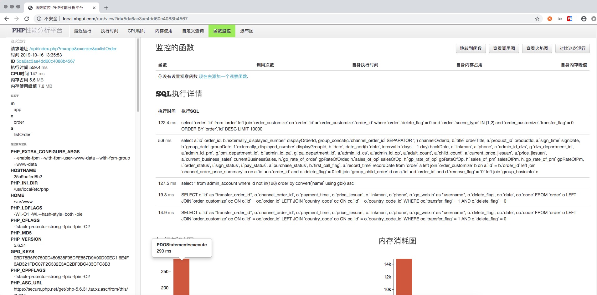

- 对比多次请求

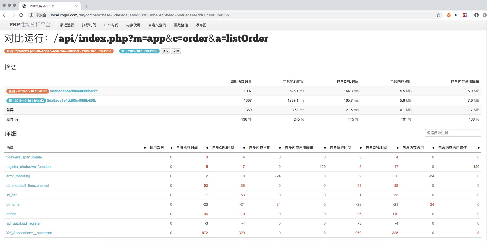

- 一次请求的火焰图

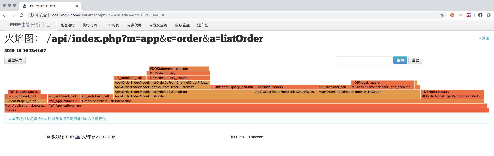

- 一次请求的调用图

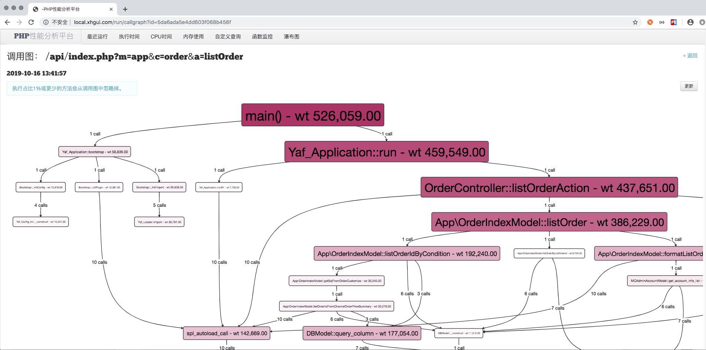